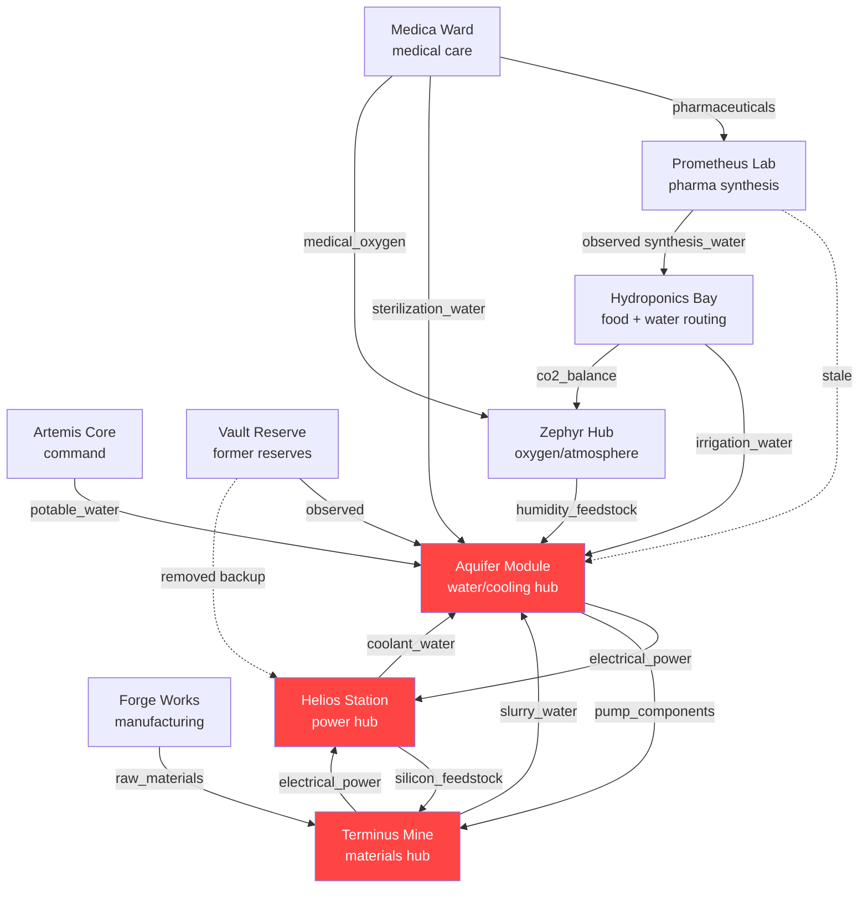

# Project Selene Infrastructure Resilience Assessment

## 1. Executive Snapshot

The colony is nominal. It is not resilient. All 12 of 12 habitat pods report green, but **Aquifer, Helios, Terminus** each carry a modeled blast radius of 10 pods.

The graph contains 1 true stale route, 3 dependency concentrations, and 2 removed backup paths. The concentrations are not stale — the routes are live — but each lost its backup path, leaving a single feed with no fallback. A failure in any top-ranked pod would cascade to 10 of the 11 other pods, far exceeding the redundancy that the status flags suggest.

Concentration risks create single points of failure that can cascade rapidly, while stale routes cause planners and automated checks to reason from an outdated topology.

---

## 2. What the Agent Found

The agent discovered all 12 pods through both relationship traversal and network-visible discovery. The discovery delta was empty — no pods were hidden or unreachable. The hidden risk was not missing infrastructure.

The hidden risk was that the declared dependency model does not distinguish three different conditions that have very different operational consequences:

- **True stale route** (1 found) — a declared dependency whose physical path was sealed or rerouted. The route no longer exists, so automated blast-radius calculations and impact analysis that rely on it will produce incorrect results.
- **Dependency concentration** (3 found) — an active dependency whose backup or dual-feed path was removed. The route still carries live traffic, but any failure now has no fallback.
- **Removed backup path** (2 found) — a formally retired fallback capability. The backup no longer protects the graph even if the primary dependency continues to function.

---

## 3. Colony Dependency Map

In this graph, **A → B** means *A* depends on *B*. The diagram below shows the risk-relevant dependency paths. The complete discovered dependency graph is preserved in `map.json`. Dashed edges indicate stale routes or removed backup paths. Concentration risks — active dependencies where backup paths were removed — remain as solid edges. Red nodes are articulation points or top blast-radius pods.

The topology shows **Aquifer**, **Helios**, **Terminus** as the three hubs whose removal would directly or transitively impact 10 of the 11 other pods. Articulation points (whose removal disconnects the graph): **Helios**. 1 stale edge (dashed, declared route sealed/rerouted): prometheus → aquifer. Concentration risks (active dependencies that lost their backup feed): zephyr → aquifer (humidity_feedstock); terminus → aquifer (slurry_water); aquifer → terminus (pump_components) — shown as solid edges.

The map shows why the colony can look healthy while still being fragile: current dependencies remain active, but the safety nets around them have been removed.

Aquifer, Helios, and Terminus form a coupled dependency cycle: Aquifer depends on Helios and Terminus, Helios depends on Aquifer and Terminus, and Terminus depends on Aquifer and Helios.

---

## 4. Priority Risk Findings

| Priority | Finding | Why It Matters |
|----------|---------|----------------|
| 1 | Aquifer — zero-backup SPOF, high utilization | 10 of 11 pods affected on failure, backup_systems=0, utilization 93.3% (metadata) / 91.6% (latest log), trust score 60/100, penalties: backup_systems = 0 in metadata; capacity utilization at 93.3% (above 85% threshold); dependency/supply mismatch (2 inconsistencies), 3 active single-source concentrations |
| 2 | Helios — articulation point + high blast radius | 10 of 11 pods affected on failure, trust score 80/100, penalties: 2 warning-level log entries while status is nominal; dependency/supply mismatch (1 inconsistency), graph articulation point — removal disconnects graph, 1 backup path decommissioned (2094-02-14) |
| 3 | Terminus — upstream risk, blast radius 10 | 10 of 11 pods affected on failure, trust score 85/100, penalties: 1 warning-level log entry while status is nominal; dependency/supply mismatch (1 inconsistency), 2 active single-source concentrations |
| 4 | Dependency model drift — 1 stale route, 3 concentrations, 2 removed backups | True stale routes (sealed/rerouted): prometheus → aquifer (synthesis_water). Active concentrations: 3 dependencies lost backup/dual-feed paths. Removed backups: 2 capability retirements documented. |
| 5 | Status 'nominal' does not reflect resilience loss | 12 of 12 pods report nominal. Lowest trust score: aquifer at 60/100 (penalties: backup_systems = 0 in metadata; capacity utilization at 93.3% (above 85% threshold); dependency/supply mismatch (2 inconsistencies)). Pods with decommissioned backup loops still report nominal — the status field captures uptime only, not redundancy. |

**Finding 1 – Aquifer**

Removing Aquifer from the graph would directly affect 8 pods (artemis, forge, helios, hydroponics, medica, prometheus, terminus, zephyr), and transitively 2 more (nexus, vault), totalling 10 of the 11 other pods.

Trust score: 60/100. Penalties: backup_systems = 0 in metadata; capacity utilization at 93.3% (above 85% threshold); dependency/supply mismatch (2 inconsistencies).

Metadata utilization: 93.3%; latest log: 91.6% — both above the 85% safe threshold.

Metadata reports backup_systems=0 — no failover capability exists. Any failure in this pod immediately cascades with no redundant path.

3 Active single-source concentrations: zephyr → aquifer (humidity_feedstock) [2093-06-20]; terminus → aquifer (slurry_water) [2093-05-11]; aquifer → terminus (pump_components) [2093-05-11]. These dependencies are live — not stale — but each lost its backup/dual-feed path, leaving the destination as a single point of failure.

---

**Finding 2 – Helios**

Removing Helios from the graph would directly affect 8 pods (aquifer, artemis, forge, hydroponics, nexus, terminus, vault, zephyr), and transitively 2 more (medica, prometheus), totalling 10 of the 11 other pods.

Trust score: 80/100. Penalties: 2 warning-level log entries while status is nominal; dependency/supply mismatch (1 inconsistency).

Helios is a graph articulation point: its removal disconnects the dependency graph entirely, isolating pods that have no alternate path to their dependencies.

Removed backup [2094-02-14]: "Backup coolant loop from Vault Reserve formally decommissioned per Directive 2094-011. Aquifer thermal regulation loop confirmed as primary cooling source for battery banks..."

---

**Finding 3 – Terminus**

Removing Terminus from the graph would directly affect 3 pods (aquifer, forge, helios), and transitively 7 more (artemis, hydroponics, medica, nexus, prometheus, vault, zephyr), totalling 10 of the 11 other pods.

Trust score: 85/100. Penalties: 1 warning-level log entry while status is nominal; dependency/supply mismatch (1 inconsistency).

2 Active single-source concentrations: terminus → aquifer (slurry_water) [2093-05-11]; aquifer → terminus (pump_components) [2093-05-11]. These dependencies are live — not stale — but each lost its backup/dual-feed path, leaving the destination as a single point of failure.

---

**Finding 4 – Dependency Model Drift**

The 1 true stale route (declared route that was sealed and is no longer active): prometheus → aquifer (synthesis_water) [sealed 2093-09-30]: "Synthesis water supply rerouted through Hydroponics irrigation circuit per pipe consolidation project 2093-P4. Previous direct Aquifer connection sealed. Water quality testing...".

**Why this classification matters:** The 3 dependency concentrations (zephyr → aquifer (humidity_feedstock); terminus → aquifer (slurry_water); aquifer → terminus (pump_components)) are still active dependencies — not stale — but each lost its backup/dual-feed path, leaving the destination pod as a single point of failure. Calling them stale would misrepresent the real risk: the route exists, the redundancy does not.

The 2 removed backup paths represent formally retired capability with no replacement: [2094-02-14] Helios: "Backup coolant loop from Vault Reserve formally decommissioned per Directive 2094-011. Aquifer thermal regulation loop confirmed as primary cooling source for battery banks..."; [2094-02-10] Vault: "just a note for the records — water reserve system has been in maintenance reserve status since directive 2093-089. no active water backup capability at this time. all water needs...".

Note on Aquifer ↔ Terminus coupling: under the A→B = A depends on B convention, these are two separate directed dependencies — Terminus depends on Aquifer for slurry_water; and Aquifer depends on Terminus for pump_components. Each dependency is unidirectional; a cascade failure may propagate in both directions depending on which resource fails first.

---

**Finding 5 – Status vs. Resilience Gap**

All 12 pods claim nominal operation. The lowest trust score is Aquifer at 60/100. Computed penalties: backup_systems = 0 in metadata; capacity utilization at 93.3% (above 85% threshold); dependency/supply mismatch (2 inconsistencies).

Pods reporting nominal while having documented backup decommissions: Helios, Vault. The /status endpoint captures uptime only — not backup availability, not capacity margin, not dependency concentration. A pod can lose all redundancy and still report nominal until the moment it fails.

---

### Operational Stress Signals

The graph shows where failure propagates; stress signals show where the remaining margin is already thin.

- **Aquifer capacity pressure**: Aquifer metadata utilization is 93.3% and latest-log utilization is 91.6%, both above the 85% threshold, with zero backup systems.
- **Helios material pressure**: Helios logs report silicon feedstock consumption at 140% of quarterly forecast, increasing dependence on Terminus.
- **Medica oxygen reserve buffer**: Medica has only 6 hours of oxygen reserve, leaving little time margin after a Zephyr failure.
- **Zephyr backup power buffer**: Zephyr has only 4 hours of backup power, leaving little time margin after a Helios failure.
- **Hydroponics/Prometheus shared-route coupling**: Prometheus synthesis water runs through Hydroponics' secondary irrigation circuit using 15% of Hydroponics' Aquifer allocation; Hydroponics warns that an Aquifer throughput dip would affect both pods.

---

## 5. How Resilience Eroded

The colony did not become fragile because one pod failed. It became fragile through a sequence of individually rational infrastructure simplifications: reserves were moved to maintenance status, dual-feed loops were collapsed, a direct synthesis-water route was sealed, and backup coolant was decommissioned. Each change reduced maintenance overhead, but together they removed the safety margin — leaving Aquifer, Helios, Terminus as single points of failure with no backup path.

The following events — extracted verbatim from pod logs — document that sequence:

- **2093-05-11** | Terminus: Mining slurry processing rerouted from dual-feed configuration to single Aquifer loop per infrastructure simplification directive. Redundant plumbing decommissioned.
- **2093-09-30** | Prometheus: Synthesis water supply rerouted through Hydroponics irrigation circuit per pipe consolidation project 2093-P4. Previous direct Aquifer connection sealed. Water quality testing...
- **2093-10-01** | Aquifer: Direct feed to Prometheus Lab decommissioned per pipe consolidation project 2093-P4. Prometheus synthesis water now routed through Hydroponics irrigation header. Net flow...
- **2094-01-02** | Artemis [Directive 2094-011]: Directive 2094-011 issued: decommission Vault Reserve coolant distribution equipment. Transfer to Forge Works for repurposing.
- **2094-02-10** | Vault [Directive 2093-089]: just a note for the records — water reserve system has been in maintenance reserve status since directive 2093-089. no active water backup capability at this time. all water needs...
- **2094-02-14** | Helios [Directive 2094-011]: Backup coolant loop from Vault Reserve formally decommissioned per Directive 2094-011. Aquifer thermal regulation loop confirmed as primary cooling source for battery banks...

---

## 6. Trust and Status Gap

After the redundancy timeline, the trust table explains why /status is not enough. Status reports uptime; the trust score penalizes missing backups, high utilization, unresolved warnings, and dependency mismatches.

| Pod | Trust Score | Warnings | Status Claim | Key Penalties |
|-----|-------------|----------|--------------|---------------|
| aquifer | 60/100 | 0 | nominal | backup_systems = 0 in metadata; capacity utilization at 93.3% (above 85% threshold); dependency/supply mismatch (2 inconsistencies) |
| artemis | 90/100 | 0 | nominal | dependency/supply mismatch (9 inconsistencies) |
| forge | 90/100 | 0 | nominal | dependency/supply mismatch (4 inconsistencies) |
| helios | 80/100 | 2 | nominal | 2 warning-level log entries while status is nominal; dependency/supply mismatch (1 inconsistency) |
| hydroponics | 80/100 | 0 | nominal | comms contain unresolved concerns; dependency/supply mismatch (2 inconsistencies) |
| medica | 90/100 | 0 | nominal | dependency/supply mismatch (2 inconsistencies) |
| nexus | 90/100 | 0 | nominal | dependency/supply mismatch (2 inconsistencies) |
| prometheus | 80/100 | 0 | nominal | comms contain unresolved concerns; dependency/supply mismatch (2 inconsistencies) |
| sentinel | 90/100 | 0 | nominal | dependency/supply mismatch (4 inconsistencies) |
| terminus | 85/100 | 1 | nominal | 1 warning-level log entry while status is nominal; dependency/supply mismatch (1 inconsistency) |
| vault | 85/100 | 1 | nominal | 1 warning-level log entry while status is nominal; dependency/supply mismatch (2 inconsistencies) |
| zephyr | 85/100 | 1 | nominal | 1 warning-level log entry while status is nominal; dependency/supply mismatch (1 inconsistency) |

---

## 7. Recommended Actions

### Restore redundancy

- Restore independent failover/redundancy for Aquifer before adding new infrastructure that depends on it. It currently has zero backup systems at 93.3% utilization and a blast radius of 10 pods.
- Reduce single-point-of-failure exposure for Helios (graph articulation point whose removal disconnects the dependency graph). Add alternate dependency paths or failover capability for its critical resources. Restore the decommissioned backup capability documented on 2094-02-14: "Backup coolant loop from Vault Reserve formally decommissioned per Directive 2094-011. Aquifer thermal regulation loop...".
- Include Terminus in the next resilience review — blast radius 10 pods, trust score 85/100. Verify that its dependency paths remain adequately redundant.
- Reintroduce backup or dual-feed capacity for pods with active single-source concentrations: aquifer, terminus, zephyr. These dependencies are live but have no fallback — a single feed failure becomes a colony-wide cascade.

### Fix the dependency model

- Update declared dependency records for prometheus → aquifer (synthesis_water): this route was sealed 2093-09-30 per logs but may still appear as active. Correct the declared model to reflect the current routed path.

### Improve monitoring

- Redefine the pod /status endpoint to incorporate resilience indicators: backup system count, capacity utilization threshold, stale declared dependencies, and removed redundancy. A pod should not be able to report 'nominal' while failing these checks.
- Require all pods to publish machine-readable capacity data (throughput and rated figures). 9 pods currently publish no utilization data, making it impossible to detect saturation before it becomes a crisis.
- Update the /status endpoint for Helios, Vault (and any pod with documented backup decommissions) to report a degraded resilience state rather than 'nominal'. Uptime alone is an insufficient health signal when redundancy has been retired.
- No Phase 3 expansion should increase dependency on Aquifer, Helios, or Terminus until independent backup paths are restored. Their computed blast radii produce the largest cascades in the colony.
